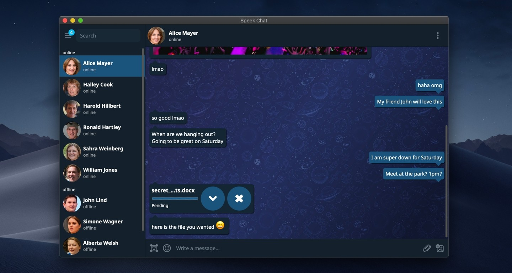

# Speek! Secure Messenger

Speek.Chat is currently available for OS X (10.12 or later), Linux and Windows. Visit the [releases page](https://github.com/Speek-App/Speek/releases) for the latest version and changelog. Alternatively, the newest version of Speek.Chat is also available on the [MacOS Appstore](https://apps.apple.com/us/app/speek/id1609665326) and the [Microsoft Store](https://www.microsoft.com/en-us/p/speek/9plhbg7k1wzn?activetab=pivot:overviewtab).

Speek is serverless, stores no metadata, requires no ID or phone number and all messages including file transfers are end-to-end encrypted and routed via the Tor network. This makes it possible that IP addresses are never public and users can stay anonymous. Furthermore, due to its decentralized (p2p) nature, there is no middleman server that could be compromised, taken down or leak user information such as IP addresses, contacts, metadata or even messages.

Users are only identified via public keys. Each user can share their public key with others to add them to their contact list.

* You can chat without exposing your identity (or IP address) to *anyone*
* Nobody can discover who your contacts are or when you talk (*metadata-free!*)
* Your messages and data are never stored on any servers and you can converse without middlemen. 
* There are no servers or operators that could be compromised, exposing your information.
* It's cross-platform and easy for non-technical users.
* All your messages are private. Nothing is stored and there is no meta-data. Once you close Speek! all your messages are deleted.
  
### How it works
Speek.Chat is a peer-to-peer instant messaging system built on the Tor Network [hidden services](https://www.torproject.org/docs/hidden-services.html.en). Your login is your hidden service address, and contacts connect to you (not an intermediate server) through Tor. The rendezvous system makes it extremely hard for anyone to learn your identity from your address.

Speek.Chat is not affiliated with or endorsed by The Tor Project.

For more information, you can [read about Tor](https://www.torproject.org/about/overview.html.en) and [learn about Speek.Chat's design](https://github.com/Speek-App/Speek/blob/main/doc/design.md) or [protocol](https://github.com/Speek-App/Speek/blob/main/doc/protocol.md).

### Downloads

Speek.Chat is currently available for OS X (10.12 or later), Linux and Windows. Visit the [releases page](https://github.com/Speek-App/Speek/releases) for the latest version and changelog. Alternatively, the newest version of Speek.Chat is also available on the [Microsoft Store](https://www.microsoft.com/en-us/p/speek/9plhbg7k1wzn?activetab=pivot:overviewtab).

### License

Everything is [open-source](https://github.com/Speek-App/Speek/blob/main/src/LICENSE) and open to contribution.

### Building from source
See [BUILDING](https://github.com/Speek-App/Speek/blob/main/BUILDING.md) for Linux, OS X, and Windows build instructions.

### Other
Bugs can be reported on the [issue tracker](https://github.com/Speek-App/Speek/issues).

