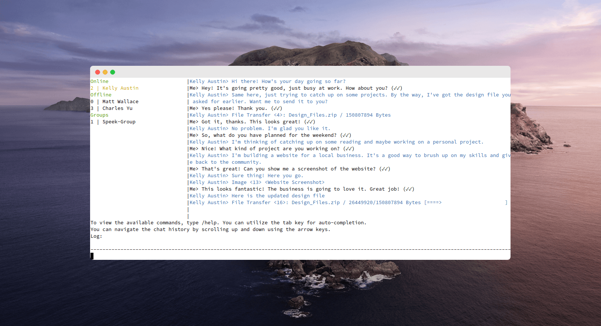

# Speek Terminal Client

## Introduction

This serves as a demonstration of the utilization of the Speek IPC QLocalServer API, which can be utilized to design additional user interfaces Speek. It is written in Python using the curses library, which provides an interface to the terminal window. The application implements various commands that interact with the main application through the IPC QLocalServer API.

<p align="center">
  
  <br>
  <em>Speek Terminal Client - Downloading a File</em>
</p>

<p align="center">
  
  <br>
  <em>It can even preview images, although this functionality is somewhat limited with only 3-bit color support...</em>
</p>

## Prerequisites

The 'speek' CLI application must reside within the same directory as this program. It can be compiled by using the argument 'CONFIG+=console'.

Additionally, before using this application, the following packages must be installed:
- curses
- threading
- qrcode

## Usage

To use this application, simply run the script using Python. e.g.:
```
python speek.py
```

The interface will be displayed in the terminal window. The following commands can be used to interact with the main application:

- /send: Sends a message to the selected contact. Example: '/send Hello, how are you?'
- /showqr: Displays the QR code of your speek id. Close by pressing 'Enter'.
- /switch: Switches to another contact. Example: '/switch 1' to switch to the second contact in the list.
- /accept_file: Accepts a file transfer. Example: '/accept_file 1 /folder/file_name' to accept the file with ID 1 and save it as 'file_name' in '/folder'.
- /reject_file: Rejects a file transfer. Example: '/reject_file 1' to reject the file with ID 1.
- /cancel_file: Cancels a file transfer. Example: '/cancel_file 1' to cancel the file with ID 1.
- /reject_and_block_request: Rejects and blocks a contact request. Example: '/reject_and_block_request 1' to reject and block the contact request with ID 1.
- /reject_request: Rejects a contact request. Example: '/reject_request 1' to reject the contact request with ID 1.
- /accept_request: Accepts a contact request. Example: '/accept_request 1' to accept the contact request with ID 1.
- /send_request: Sends a contact request. Example: '/send_request speek_id nickname my_nickname message' to send a request to the specified 'speek_id' and set the recipient's name as 'nickname'. Your name will be suggested as 'my_nickname' and a 'message' can be included.
- /rename: Sets the nickname for a contact. Example: '/rename 1 nickname' to set the nickname for contact with ID 1 to 'nickname'.
- /show_config_path: Displays the path of the configuration folder.
- /show_my_speek_id: Displays your speek id.
- /help: Displays the list of commands and their descriptions.
- /show_contact_requests: Displays a list of all contact requests.
- /show_image: Displays the selected image directly in the terminal window.
- /quit: Closes this application.
 